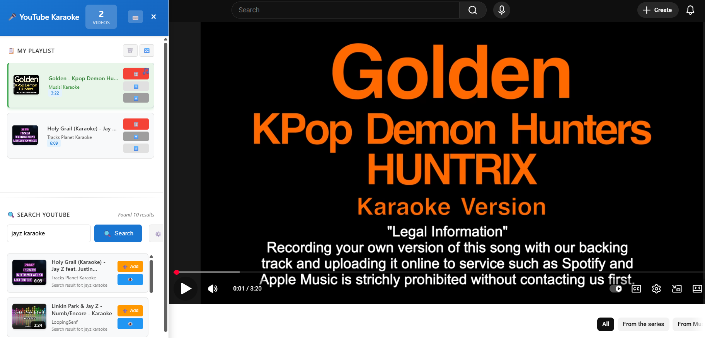
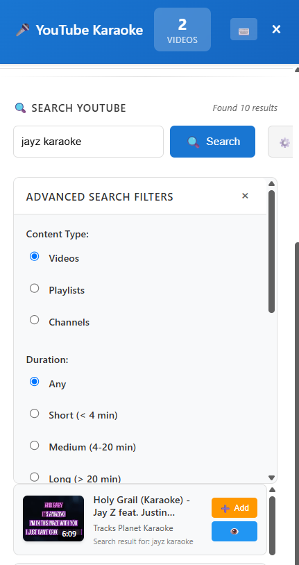
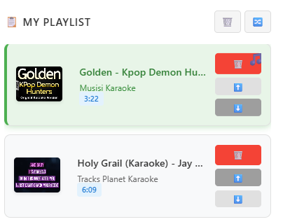
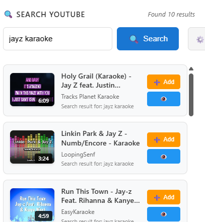

# 🎤 YouTube Karaoke Extension

Transform YouTube into a karaoke experience with a powerful split-panel interface for playlist management and advanced search.


## ✨ Features

### 🎵 **Split-Panel Interface**
- Clean, modern left-side panel that doesn't interfere with YouTube
- Automatic content shifting keeps YouTube videos perfectly centered
- Smooth animations and professional UI design

### 🔍 **Advanced Search & Discovery**
- Real YouTube search using your logged-in session
- Advanced filters: duration, upload date, content type, quality
- Sort by relevance, date, rating, or view count
- Search for videos, playlists, or channels

### 📋 **Smart Playlist Management**
- Add videos directly from search results
- Drag-and-drop reordering
- Shuffle playlist functionality
- Remove videos with one click
- Persistent storage - your playlists are saved

### 🎯 **Visual Feedback**
- Currently playing video highlighted in green with music note icon
- Real-time playlist updates
- Loading states and error handling
- Keyboard shortcuts for power users

### ⌨️ **Keyboard Shortcuts**
- `Ctrl/Cmd + K` - Focus search
- `Escape` - Close panel
- `Space` - Play/pause
- `Arrow Keys` - Navigate playlist
- `Delete` - Remove selected item

## 🚀 Quick Start

### Installation

1. **Download** the extension files
2. **Extract** to a folder on your computer
3. **Open** Brave/Chrome and go to `brave://extensions/` or `chrome://extensions/`
4. **Enable** "Developer mode" (toggle in top-right)
5. **Click** "Load unpacked" and select the extension folder
6. **Visit** YouTube and start using the extension!

### Usage

1. **Open YouTube** in your browser
2. **Click** the extension icon in the toolbar
3. **Search** for songs using the advanced filters
4. **Add** videos to your karaoke playlist
5. **Play** videos directly from the playlist
6. **Enjoy** the seamless karaoke experience!

## 📸 Screenshots

### Main Interface

*Split-panel interface with playlist and search sections*

### Advanced Search

*Advanced filters panel with various search options*

### Playlist Management

*Playlist with highlighted currently playing video*

### Search Results

*Search results with add buttons*

## 🛠️ Development

### Prerequisites
- Node.js 16+ 
- npm 8+
- Brave Browser or Chrome

### Setup
```bash
# Clone the repository
git clone <repository-url>
cd Youtube_Karaoke_Brave_Extension

# Install dependencies
npm install

# Build the extension
npm run build

# Watch for changes during development
npm run dev
```

### Project Structure
```
├── src/
│   ├── background.ts      # Background script
│   ├── content.ts         # Content script (main functionality)
│   ├── popup.ts          # Popup script
│   ├── popup.html        # Popup HTML
│   ├── content.css       # Content script styles
│   └── popup.css         # Popup styles
├── icons/                # Extension icons
├── dist/                 # Built extension files
├── manifest.json         # Extension manifest
├── webpack.config.js     # Webpack configuration
└── package.json          # Project dependencies
```

### Building
```bash
# Production build
npm run build

# Development build with watch
npm run dev
```

## 🔧 Technical Details

### Architecture
- **Manifest V3** compliant
- **TypeScript** for type safety
- **Webpack** for bundling
- **Chrome Extension APIs** for functionality

### Browser Support
- ✅ Brave Browser (primary)
- ✅ Chrome Browser
- ✅ Other Chromium-based browsers

### Permissions
- `storage` - Save playlist data locally
- `activeTab` - Access current tab for YouTube
- `scripting` - Inject content scripts
- `https://www.youtube.com/*` - Access YouTube pages

## 📋 Features in Detail

### Search Functionality
- **Real YouTube Search**: Uses your logged-in YouTube session
- **Advanced Filters**: Duration, upload date, content type, quality
- **Smart Sorting**: Relevance, date, rating, view count
- **Content Types**: Videos, playlists, channels

### Playlist Management
- **Add/Remove**: Easy playlist management
- **Reordering**: Drag-and-drop or arrow buttons
- **Shuffle**: Randomize playlist order
- **Persistence**: Playlists saved locally
- **Visual Feedback**: Currently playing video highlighted

### User Experience
- **Keyboard Shortcuts**: Power user features
- **Smooth Animations**: Professional UI transitions
- **Responsive Design**: Works on all screen sizes
- **Error Handling**: Graceful error management

## 🔒 Privacy & Security

This extension:
- ✅ **No Data Collection**: Doesn't collect any personal data
- ✅ **No Tracking**: Doesn't track your browsing habits
- ✅ **Local Storage Only**: All data stored locally in your browser
- ✅ **No External Servers**: Works entirely with YouTube
- ✅ **Open Source**: Full source code available

## 🐛 Troubleshooting

### Common Issues

**Extension not loading:**
- Ensure you're using a supported browser
- Check that Developer mode is enabled
- Try reloading the extension

**Search not working:**
- Make sure you're logged into YouTube
- Check your internet connection
- Try refreshing the page

**Playlist not saving:**
- Check browser storage permissions
- Clear browser cache and try again
- Ensure you have enough storage space

### Getting Help
- Check the [Issues](https://github.com/your-repo/issues) page
- Create a new issue with detailed information
- Include browser version and error messages

## 📈 Roadmap

### Upcoming Features
- [ ] Playlist sharing and collaboration
- [ ] Custom themes and appearance
- [ ] Playlist import/export
- [ ] Advanced keyboard shortcuts
- [ ] Mobile browser support

### Version History
- **v1.0.0** - Initial release with core functionality
- **v1.1.0** - Planned: Enhanced search filters
- **v1.2.0** - Planned: Playlist sharing features

## 🤝 Contributing

We welcome contributions! Please see our [Contributing Guidelines](CONTRIBUTING.md) for details.

### Development Setup
1. Fork the repository
2. Create a feature branch
3. Make your changes
4. Test thoroughly
5. Submit a pull request

## 📄 License

This project is licensed under the MIT License - see the [LICENSE](LICENSE) file for details.

## 🙏 Acknowledgments

- YouTube for the amazing platform
- Brave Browser team for the excellent browser
- Open source community for inspiration
- All users and contributors

## 📞 Support

- **Email**: support@youtubekaraoke.com
- **GitHub**: [Issues](https://github.com/your-repo/issues)
- **Discord**: [Community Server](https://discord.gg/your-server)

---

**Made with ❤️ for karaoke enthusiasts everywhere!**

*Transform your YouTube experience into the ultimate karaoke platform!*